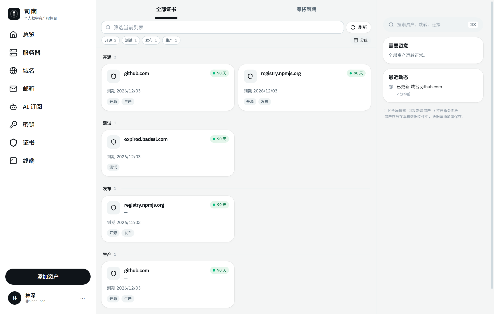
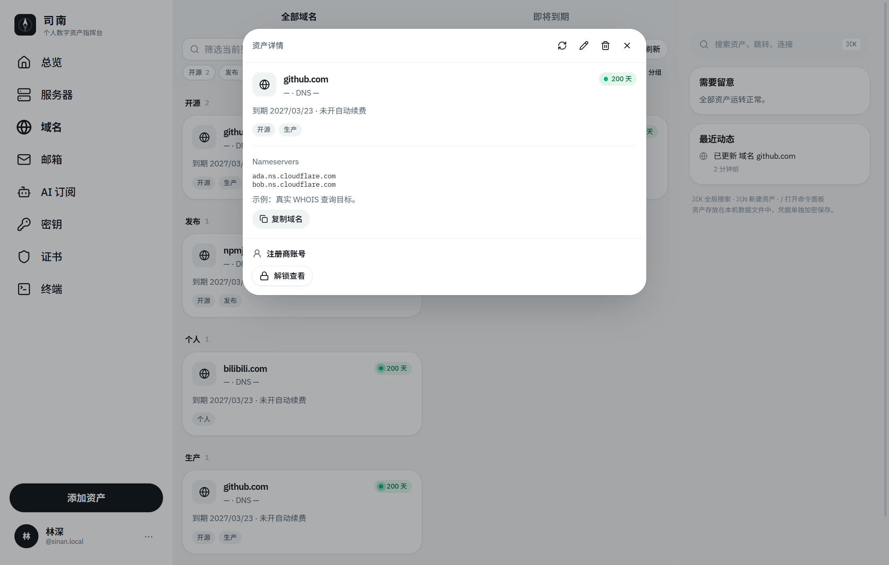
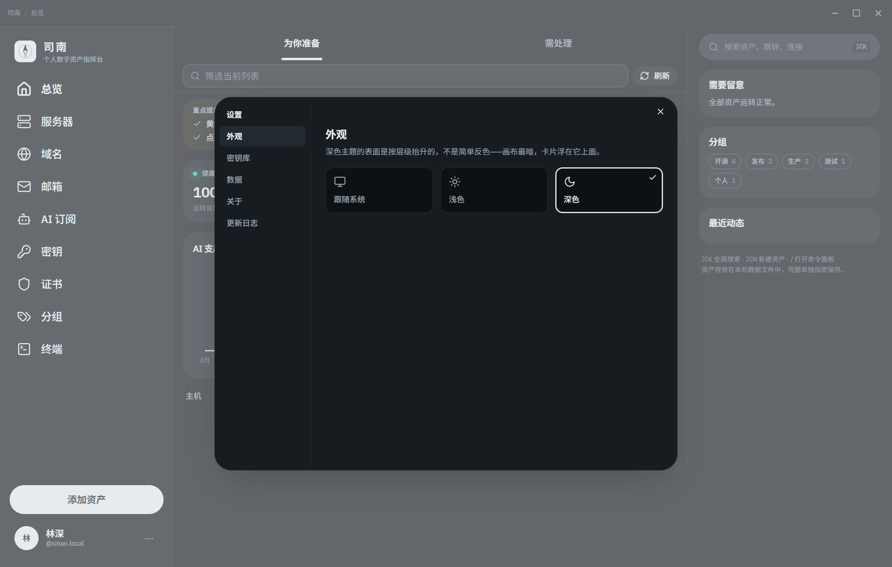

# 司南 · Nanpad

> 个人数字资产指挥台 —— 一个真实可用的桌面软件。服务器、域名、邮箱、AI 订阅、密钥与证书，一屏尽览。

司南（Sīnán）是汉代的磁石罗盘：一块方形地盘，一根永远知道方向的勺针。这个软件做的是同一件事——把散落在各处的数字资产收进一块盘面，让你一眼看出**哪边有问题**。

**它不是一个网页 demo。** 主机指标通过真实 SSH 连接采集，域名到期日来自真实 WHOIS 查询，证书信息是直接跟对方服务器握手读回来的，终端是真的 PTY。


<sub>上图是真实数据：github.com 的 Sectigo 证书还有 87 天，npmjs.org 的 Google Trust Services 证书还有 79 天，而 expired.badssl.com 被判定为 `CERT_HAS_EXPIRED` 并冒泡到右栏「需要留意」。</sub>

---

## 目录

- [这是什么](#这是什么)
- [真实到什么程度](#真实到什么程度)
- [截图](#截图)
- [安装与运行](#安装与运行)
- [功能](#功能)
- [分组与标签](#分组与标签)
- [账号与密码](#账号与密码)
- [快捷录入](#快捷录入)
- [设置](#设置)
- [安全模型](#安全模型)
- [界面与动效](#界面与动效)
- [键盘快捷键](#键盘快捷键)
- [项目结构](#项目结构)
- [设计系统](#设计系统)
- [打包分发](#打包分发)
- [技术栈](#技术栈)
- [已知边界](#已知边界)
- [路线图](#路线图)

---

## 这是什么

一个 **Electron 桌面应用**，跑在你自己的电脑上，不连任何后端服务器，没有账号，没有云端。

它解决的问题是：你手上有几台 VPS、十几个域名、一堆邮箱转发规则、几个 AI 订阅、若干 API Key 和 SSL 证书。它们分散在阿里云、Cloudflare、OpenAI、1Password……**没有任何一个地方能同时告诉你「下周有什么要到期、哪台机器现在不对劲」**。司南就是那个地方。

架构上分两半：

- **主进程（Node）** —— 握着真实能力：`ssh2` 连服务器、`net` 打 WHOIS、`tls` 握手读证书、`crypto` 加密凭据库
- **渲染进程（React）** —— 只管界面，通过 `contextBridge` 暴露的一个白名单 API 跟主进程说话，拿不到 Node，也拿不到未列出的 IPC 通道

同一套界面代码还能作为网页跑（`npm run dev`），那种模式下没有主进程，SSH 终端退化成一个明确标注「模拟会话」的演示壳——用来预览界面，不用来干活。

---

## 真实到什么程度

| 能力 | 实现 | 说明 |
| --- | --- | --- |
| **SSH 终端** | `ssh2` + `xterm.js` | 真实 PTY。真的登录、真的回显、Ctrl-C 真的会打断远端进程，窗口拉伸会把新的行列数同步给远端 |
| **主机指标** | SSH 一次性脚本 | CPU 取两次 `/proc/stat` 采样（间隔 400ms）算出来，不是 `top` 的首帧假值；内存读 `MemAvailable`，磁盘读 `df -Pk /`，另带 uptime、负载、内核版本 |
| **域名到期** | 原生 WHOIS（TCP 43） | IANA 查 TLD 归属 → 注册局 → 最多再跟一跳注册商。解析注册商、注册日、到期日、域名状态 |
| **DNS** | `dns.resolveNs` | NS 记录以实时查询为准，WHOIS 里的记录只作兜底；再据此推断 DNS 服务商（Cloudflare / Route 53 / DNSPod…） |
| **SSL 证书** | `tls.connect` | 直接握手，读签发者、有效期、SAN、序列号、协议版本。**故意不校验证书链**——过期或不受信任正是要报出来的情况，拒绝握手反而会把它藏起来 |
| **凭据存储** | scrypt + AES-256-GCM | SSH 凭据、各服务的账号密码、密钥内容都在这里；主密码派生的密钥只存在内存，磁盘上只有密文 |
| **邮箱** | IMAP 登录校验 | 快捷登录真的连服务商 IMAP：验证授权码可用，并读回容量、收件箱与未读数 |
| AI 订阅 | 手工录入 | 各家计费 API 差异太大，暂时只做记录与到期提醒 |

不联网的东西一律不假装：没连过的主机不会显示编造的 CPU 数字，采集失败会把失败原因直接写在卡片上。

---

## 截图

<table>
<tr>
<td width="50%"><br><em>真实 WHOIS：注册商、到期倒计时、DNS 服务商</em></td>
<td width="50%"><br><em>录入主机时填 SSH 凭据，可当场「测试连接」</em></td>
</tr>
<tr>
<td width="50%"><br><em>按标签分组，一个资产可以同时属于多个分组</em></td>
<td width="50%"><br><em>详情页读取加密保存的账号密码，一键复制</em></td>
</tr>
<tr>
<td width="50%"><br><em>设置：外观 / 密钥库 / 数据 / 关于 / 更新日志</em></td>
<td width="50%"><br><em>深色主题：表面按层级抬升，不是简单反色</em></td>
</tr>
</table>


---

## 安装与运行

需要 **Node 22+**。

```bash
npm install
npm run desktop
```

这会启动渲染进程的 Vite 开发服务器（`127.0.0.1:8090`）并拉起 Electron 窗口，改代码即时热更新。

想直接跑打包好的界面（不带热更新）：

```bash
npm run desktop:build
npx electron .
```

只想在浏览器里看界面（无真实能力，SSH 为模拟）：

```bash
npm run dev     # http://localhost:8080
```

> Windows 上 `npm run dev` 走 `scripts/with-app-env.mjs`，该脚本用 `spawn` 直接调 `vite`，在 Windows 会报 `ENOENT`。替代命令：
>
> ```bash
> node scripts/with-app-env.mjs node node_modules/vite/bin/vite.js dev --host 0.0.0.0 --port 8080
> ```

### 第一次用

桌面版**首次启动是空的**——不塞演示数据，因为这里的按钮会真的拨号出去，示例 IP 只会变成一排连接失败。

1. 点「添加第一台主机」，填主机名、IP、端口、用户名
2. 在「SSH 凭据」里选密码或私钥，点**测试连接**确认能通
3. 保存时会让你设一个**主密码**（第一次），凭据加密后落盘
4. 之后每个视图右上角的「刷新」会去采集真实数据；解锁密钥库后，主机指标每 90 秒自动扫一轮

---

## 功能

| 模块 | 说明 |
| --- | --- |
| **总览** | 健康分、在线主机数、AI 月费、待处理数；支出趋势图；最近动态 |
| **服务器** | 主机名 / IP / 端口 / 系统 / 区域 / 标签；CPU·内存·磁盘来自真实采集；一键开真实 SSH 会话 |
| **域名** | WHOIS 实查：注册商、到期倒计时、域名状态、实时 NS 记录 |
| **邮箱** | 邮箱 / 别名 / 转发三种类型；快捷登录后容量与收件箱数据来自真实 IMAP |
| **AI 订阅** | 厂商、套餐、月费、本月用量、续费日（手工录入） |
| **密钥** | API / SSH / 密码 / Token；完整值存在加密库中，卡片只留提示片段 |
| **证书** | TLS 实查：签发者、有效期、SAN、协议版本、证书链是否受信 |
| **终端** | 真实 SSH 会话，xterm.js 渲染，命令历史与窗口 resize 都是原生行为 |

每一类资产都可以打标签、按标签分组，也都可以附一份加密保存的账号密码——见下面两节。

**状态语义**（全局一致，三色制）：

- 🟢 **正常** —— 无需关注
- 🟡 **注意** —— 到期 ≤ 21 天 / 负载 ≥ 78% / 用量 ≥ 90%
- 🔴 **告警** —— 主机不可达、证书链不受信、到期 ≤ 7 天、资源 ≥ 90%

右栏「需要留意」把六类资产的异常按严重度汇总在一起，不随视图切换。

---

## 分组与标签

六类资产共用一套标签，所以一个项目的主机、域名和证书可以落在同一个分组里。

- 录入时在「标签」字段用逗号分隔即可，中英文逗号、分号、换行都认
- 列表顶部的标签条列出**当前分类里实际存在**的标签和数量；点一个收窄列表，点多个取交集（AND），「清除」一键还原
- 卡片上的标签也可以点，等同于在标签条里选中它
- 右上角的「平铺 / 分组」开关把列表拆成一节一个标签。一个资产带三个标签就会出现在三节里——标签是标记，不是文件夹；没打标签的收在末尾的「未分组」
- 标签选择属于当前列表，切换分类时自动清空

**跨分类的「分组」视图**（左栏第八项）才是标签真正的用处：`生产` 不是主机的标签也不是域名的标签，它是把一个项目的主机、域名和证书串起来的那根线。

- 没选标签时列出全部标签，每张卡显示总数和按类型的拆分（域名 2 · 证书 2）
- 选中一个之后，页面变成该标签下的**全部资产**，按类型分节
- 「需处理」标签页在这里是「哪些分组里有问题」
- 右栏常驻一块「分组」面板，点任意标签直接跳进来；⌘K 里也能搜到标签

## 账号与密码

除了 SSH 凭据，**每一类资产**都能附一份账号信息：登录地址、账号、密码、备注（恢复码 / 授权码 / 二次验证）。面板标题会随资产类型变化——域名是「注册商账号」，邮箱是「邮箱账号」，密钥则是「密钥内容」。

- 在新增 / 编辑表单里录入，密码框带显示开关
- 打开卡片详情就能看到，密码默认打码，一键显示或复制，登录地址可直接用系统浏览器打开
- 全部存进加密库（`account:<资产 id>`），**不写入资产文件**，导出 JSON 时不会带出去
- 早期版本把密钥的完整值明文存在 `assets.json` 里；密钥库第一次解锁时会自动把它们搬进加密库并清空原字段

---

## 快捷录入

录资产最烦的是把已经在剪贴板里的东西再敲一遍，所以有两条捷径。

### 智能粘贴

每个表单顶部都有。粘一段内容，它说出自己认为那是什么，你确认后才合并进字段——不静默改任何东西。

| 粘什么 | 得到什么 |
| --- | --- |
| `ssh -p 2222 deploy@10.20.30.40` | 主机 / 用户名 / 端口 |
| `~/.ssh/config` 里的一段 Host | 别名 / 主机 / 用户 / 端口 / 私钥路径 |
| 私钥（OpenSSH / PEM） | 认证方式切到私钥，内容进加密库 |
| 证书 PEM | 主进程真解析 X.509：签发者、有效期、SAN |
| `sk-…` `ghp_…` `AKIA…` 等 | 认出厂商与类型，完整值进加密库 |
| 邮箱地址 / IMAP·SMTP 设置 | 地址、域名、服务器设置 |

打开时会自动读剪贴板——你要粘的东西通常已经在里面了。**提示与解析结果都按资产类型过滤**：填邮箱时不会提示 SSH，填 AI 订阅时提示的是 API Key。

### 邮箱快捷登录

邮箱表单上的「快捷登录」直连服务商的 IMAP，**真的登录一次**，然后用服务器返回的数据填表：地址、域名、容量占用、收件箱与未读数、IMAP/SMTP 地址。凭据校验通过之后才进加密库，不经过任何中间服务。

内置 QQ / 163 / 126 / Gmail / Outlook / iCloud 的服务器地址，输入地址即自动识别；其它邮箱手填 IMAP 地址即可。

同一块面板下面还有 **Google / Microsoft 授权登录**：在你自己的浏览器里完成 OAuth（PKCE + 本地回环回调），拿回**已验证的地址**和刷新令牌。

> 两条路解决的是不同问题。**OAuth 永远不会把密码交给第三方应用**——它给的是 token，所以它能证明"这个地址确实是你的"，但换不来一条可以存进密钥库的凭据。IMAP 反过来：它验证你手上那条授权码确实能用，并顺带读回真实的容量和信件数。国内邮箱也只有 IMAP 这条路，QQ / 163 都不对第三方开放 OAuth。
>
> OAuth 客户端需要你自己在服务商控制台注册一个（免费）。Google 选「桌面应用」类型，下载的 `client_secret_*.json` 可以直接在面板里选文件读入，客户端 ID 与密钥存进加密库。**记得把应用发布到生产**——停在「测试」状态时 Google 发的刷新令牌只有 7 天有效期；我们只用 `openid / email / profile` 这三个非敏感范围，发布不需要 Google 审核。

---

## 设置

侧栏头像旁的 `···` → 「设置…」，或按 `⌘,` / `Ctrl+,`。

**外观** —— 跟随系统 / 浅色 / 深色。选「跟随系统」时会实时跟着系统切换，不用重启。深色不是把浅色反过来：表面按层级抬升（画布最暗，卡片浮在上面），阴影在这个亮度下不起作用，所以换成发丝描边；状态色、标签、滚动条都单独校过。

**密钥库** —— 查看状态、立即锁定、**修改主密码**。换密码会用新盐派生新密钥，把每一条凭据解密再重新加密，全部成功后才写盘——中途崩溃不会留下一半读不出来的记录。

**数据** —— 打开数据目录、导出 / 导入 JSON、清空全部资产（不动密钥库）。

**关于** —— 当前版本、运行环境、**检查更新**（走 Electron 的 `net`，会跟随系统代理；私有仓库或限流时明确告诉你"查不了"，而不是谎称"已是最新"）、项目主页。

**更新日志** —— 见 [CHANGELOG.md](CHANGELOG.md)。应用内和仓库里读的是同一份数据：`src/lib/changelog.ts` 是源，`node scripts/write-changelog.mjs` 生成 Markdown。

---

## 安全模型

**存在哪里**

| 内容 | 位置 | 形式 |
| --- | --- | --- |
| 资产记录 | `%APPDATA%/Nanpad/assets.json`（macOS 为 `~/Library/Application Support/Nanpad`） | 明文 JSON |
| SSH 密码 / 私钥 | 同目录 `vault.enc` | AES-256-GCM 密文 |
| 各服务账号密码 | 同上，键名 `account:<资产 id>` | AES-256-GCM 密文 |
| 密钥完整值 | 同上 | AES-256-GCM 密文 |
| 主密码 | **哪儿都不存** | 只在内存里派生成密钥；可在设置里更换，换后全部记录用新密钥重新封装 |

**怎么加密**

主密码经 `scrypt`（N=2^15, r=8, p=1）派生出 32 字节密钥，每条记录独立随机 IV，AES-256-GCM 加密并保存认证标签。解锁校验用的是一段密封常量而非口令哈希——磁盘上没有任何可以离线爆破口令的材料。锁定（或退出）之后密钥即从内存丢弃。

**边界在哪**

- 凭据**不写入** `assets.json`，导出 JSON 时也不会带出去
- 渲染进程拿不到明文私钥：编辑主机时只回读「已保存（密码/私钥）」这个事实，不回读值。账号密码则会在密钥库解锁后回读进编辑表单——那是你自己刚解锁的本机会话，让编辑变成编辑而不是重打一遍
- `contextIsolation: true`、`nodeIntegration: false`，preload 里通道名写死，页面无法访问未列出的 IPC
- 打包页面带 CSP，只允许本地脚本
- **本软件不是密码管理器**：一个能读你用户目录的进程，仍然可以在你解锁期间读到内存中的密钥。它防的是「笔记本丢了 / 备份被翻」，不是本机上的恶意程序

---

## 界面与动效

桌面端是 **三栏布局**：左侧导航、中间内容列、右侧常驻信息栏（全局搜索 / 需要留意 / 快捷终端 / 最近动态）。中间列的卡片列数用 CSS **容器查询**决定，跟随列宽而不是窗口宽度——右栏占掉 340px，视口断点看不到这件事。

窗口是无边框的，**标题栏由应用自己画**：整条 44px 都可拖拽（双击最大化），左边显示当前所在的视图，右边是自绘的最小化 / 最大化 / 关闭。系统的标题栏按钮改不了样式，那块灰色方块 hover 是整个界面里唯一不守设计系统的地方；现在它们和侧栏用同一套 hover（圆角 + `--color-line` 填充），关闭键 hover 转红。macOS 保留原生红绿灯，那是肌肉记忆。

动效遵循一条原则：**交互状态用 transition，一次性入场用 keyframes**。前者能在动画中途反向、不会卡住；后者只在元素出现时跑一次。

- **卡片放大 / 收起** —— FLIP 共享元素动画。详情面板从被点击的那张卡片长出来，关掉时缩回**它当前的真实位置**（滚动过也不会缩错地方）
- **标签下划线** —— 一根横条在两个标签之间滑动，宽度贴合文字
- **视图切换** —— 内容整体 opacity + translateY + blur 入场，列表项 40ms 阶梯错峰
- **数字滚动** —— 健康分、月费等大数字三次缓出滚到位
- **弹层** —— 遮罩淡入、面板 blur + scale 入场；退场时长约为入场一半（退场不该抢注意力）
- **采集反馈** —— 探测中的卡片显示「正在采集…」，失败时把失败原因留在卡片上
- **终端** —— 玻璃背景模糊，xterm 主题与全局 token 同源
- **滚动条** —— 没有常驻的灰条：轨道全透明，滑块平时隐形，指针移到能滚的区域才淡入，悬停加深，按下再加深一档；终端里换成白色以免陷进深色背景

全部动效受 `prefers-reduced-motion: reduce` 保护。

---

## 键盘快捷键

| 按键 | 作用 |
| --- | --- |
| `⌘K` / `Ctrl+K` | 全局搜索：跳转页面、定位资产、直接连 SSH |
| `⌘N` / `Ctrl+N` | 在当前分类下新建资产 |
| `/` | 打开命令面板 |
| `⌘,` / `Ctrl+,` | 打开设置 |
| `Esc` | 关闭当前弹层 / 详情（终端里 Esc 归远端 shell，用标题栏关闭） |

---

## 项目结构

```
electron/
├─ main.mjs               主进程：窗口、菜单、IPC 路由、单实例
├─ preload.cjs            contextBridge → window.sinan（唯一对外接口）
├─ renderer/
│  ├─ index.html          渲染进程入口（CSP 在这里）
│  └─ main.tsx            React 挂载点
└─ services/
   ├─ ssh.mjs             ssh2 连接管理、PTY 会话、指标采集脚本、错误翻译
   ├─ net-probe.mjs       WHOIS 两跳查询 + DNS NS + TLS 证书握手
   ├─ mail.mjs            邮箱服务商表 + 真实 IMAP 登录校验
   ├─ oauth.mjs           桌面 OAuth：PKCE + 本地回环回调
   └─ vault.mjs           scrypt + AES-256-GCM 凭据库

src/
├─ components/
│  ├─ app-shell.tsx       三栏骨架、全局快捷键、定时采集
│  ├─ sidebar.tsx         左栏导航 + 主 CTA + 个人菜单（含锁定密钥库）
│  ├─ right-rail.tsx      右栏：全局搜索 / 需要留意 / 快捷终端 / 最近动态
│  ├─ views.tsx           标签栏（滑动下划线）、总览、六个资产列表、首次引导
│  ├─ asset-card.tsx      六种资产卡片（compact / 展开两态共用）
│  ├─ expand-layer.tsx    FLIP 放大详情层
│  ├─ live-shell.tsx      xterm + 真实 PTY
│  ├─ ssh-terminal.tsx    终端窗口外壳 + 浏览器端模拟壳
│  ├─ credential-fields.tsx  SSH 凭据录入与测试
│  ├─ smart-paste.tsx     智能粘贴：认出粘贴内容并填表
│  ├─ mail-login.tsx      邮箱快捷登录（真实 IMAP 校验）
│  ├─ oauth-login.tsx     Google / Microsoft 授权登录
│  ├─ account-fields.tsx  账号密码录入（写入加密库）
│  ├─ account-panel.tsx   详情页的账号读取与复制
│  ├─ tag-bar.tsx         标签条、分组开关、卡片上的标签
│  ├─ window-controls.tsx 应用自绘的最小化 / 最大化 / 关闭
│  ├─ title-bar.tsx       可拖拽的标题栏（窗口标题 + 窗口按钮）
│  ├─ settings.tsx        设置面板：外观 / 密钥库 / 数据 / 关于 / 更新日志
│  ├─ vault-gate.tsx      主密码对话框（唯一输入口）
│  ├─ composer.tsx        新增 / 编辑表单
│  ├─ command-palette.tsx ⌘K 命令面板
│  └─ refresh-button.tsx  整批刷新 / 单条重采
├─ lib/
│  ├─ desktop.ts          window.sinan 的类型定义与取用（浏览器下返回 null）
│  ├─ probes.ts           把探测结果写回资产、并发控制、状态判定
│  ├─ vault-state.ts      密钥库状态与 require() 解锁流程
│  ├─ vault-migrate.ts    把早期明文密钥值搬进加密库
│  ├─ tags.ts             标签解析、计数、分组
│  ├─ parse-paste.ts      粘贴内容识别（含单元测试）
│  ├─ settings.ts         主题选择与 data-theme 同步
│  ├─ changelog.ts        更新日志（CHANGELOG.md 由它生成）
│  ├─ store.ts            zustand + persist（桌面写文件，网页写 localStorage）
│  ├─ motion.ts           usePresence / useCountUp / FLIP 计算 / 减动效判定
│  ├─ status.ts           状态语义、健康分、异常统计
│  └─ types.ts            资产类型定义
└─ styles.css             设计 token + 组件类 + 动效 keyframes
```

---

## 设计系统

所有 token 定义在 `src/styles.css` 的 `@theme` 里，是 Tailwind v4 的单一来源。JSX 里没有裸十六进制色值，也没有 `p-[16px]` 这类随手值。

**颜色**（中性色 + 三个状态色）

| Token | 值 | 用途 |
| --- | --- | --- |
| `--color-canvas` | `#f4f5f5` | 页面底色 |
| `--color-card` / `--color-sidebar` | `#ffffff` | 卡片、侧栏 |
| `--color-ink` | `#0f1419` | 正文、主按钮 |
| `--color-muted` / `--color-subtle` | `#536471` / `#8b98a5` | 次级、三级文字 |
| `--color-line` / `--color-line-strong` | `#eff3f4` / `#cfd9de` | 分隔线、输入框描边 |
| `--color-ok` / `--color-warn` / `--color-crit` | `#00ba7c` / `#ffad1f` / `#f4212e` | 正常 / 注意 / 告警 |

**字体**：IBM Plex Sans（正文，中文回落思源黑体 / Noto Sans SC）+ IBM Plex Mono（主机名、IP、终端）。

**动效尺度**：`--dur-fast: 150ms`（悬停、按压）、`--dur-base: 240ms`（弹层）、`--dur-slow: 340ms`（下划线、FLIP），缓动统一 `--ease-out-soft`。

> 一个值得记下的坑：`tailwind-merge` 只认识原生 Tailwind 的类名。自定义颜色 `text-card` 会被它归成**字号**类，于是后面的 `text-body` 把颜色悄悄吃掉——主按钮因此变成黑底黑字。`src/lib/utils.ts` 用 `extendTailwindMerge` 把本项目 token 全部登记了一遍。

---

## 打包分发

```bash
npm run desktop:pack     # 只出目录：release/win-unpacked/
npm run desktop:dist     # 出安装包：Windows NSIS / macOS dmg / Linux AppImage
```

> **打包前请先停掉开发服务器。** Vite 的文件监听会占住项目目录的句柄，electron-builder 重命名 `release/win-unpacked.tmp` 时会拿到 `EPERM`。停掉 dev server 后重跑即可。

图标源文件在 `build/icon.png`（512×512），electron-builder 会自动转成各平台格式。

---

## 技术栈

- **Electron 44** —— 桌面外壳，主进程持有 Node 能力
- **ssh2** —— SSH 连接与 PTY
- **@xterm/xterm** —— 终端渲染
- **React 19** + **TypeScript**（`strict`）
- **Tailwind CSS v4** —— CSS-first token，容器查询
- **zustand**（+ `persist`）—— 状态与持久化
- **recharts** / **cmdk** / **lucide-react** / **sonner**
- **Vite 8** —— 渲染进程构建（桌面与网页两套配置）
- **electron-builder** —— 打包

---

## 已知边界

- **AI 订阅是手工录入**：各家厂商的用量 API 各不相同，暂时不做半吊子实现
- **邮箱的「别名 / 转发」仍需手填**：IMAP 能查容量和信件数，查不到投递规则
- **WHOIS 解析是尽力而为**：各 TLD 的返回格式没有统一标准，常见后缀（.com/.net/.org/.io/.dev/.cn 等）覆盖良好，冷门后缀可能只拿到部分字段
- **主机指标面向 Linux**：采集脚本读 `/proc`，BSD / macOS 主机只能拿到能拿的部分（系统名、uptime 等）
- **没有代码签名**：自己打的包在 Windows 上会被 SmartScreen 提示，属正常现象

---

## 路线图

- [ ] 托盘常驻 + 到期与离线的系统通知
- [ ] 指标历史留存，画出真实的 CPU / 内存曲线
- [ ] SFTP 文件浏览（`ssh2` 已经带了）
- [ ] 资产之间的关联（域名 → 证书 → 主机）
- [ ] 把「需要留意」导出成 ICS 日历

---

## 许可

MIT
