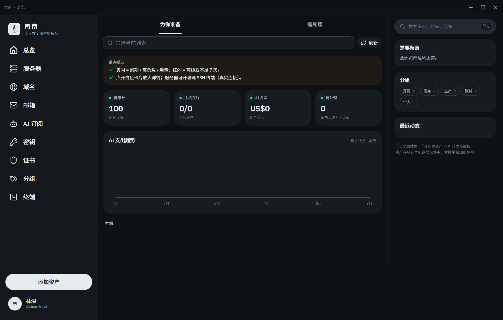
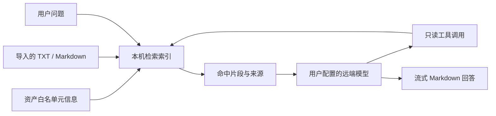

# 司南 Nanpad

个人数字资产工作台，将主机、域名、邮箱、AI 订阅、密钥和证书集中到一个桌面应用中。资产保存在本机；通过 SSH、DNS、TLS 和服务商 API 读取实际状态，通过你配置的模型进行有来源的问答。

[下载安装包](https://github.com/Songwo/nanpad/releases/latest) · [使用教程](docs/USER-GUIDE.md) · [产品介绍](docs/PRODUCT.md) · [AI 服务授权](docs/AI-ACCOUNTS.md) · [模型与本地 RAG](docs/AGENT-RAG.md) · [安全与备份](docs/SECURITY.md) · [更新日志](CHANGELOG.md)

[社区友链 · LINUX DO](https://linux.do/) · 真诚、友善、团结、专业。



## 安装与首次使用

1. 在 GitHub Releases 下载 `Nanpad-0.5.0-setup.exe`，适用于 Windows x64。
2. 运行安装程序，选择安装位置。当前安装包未做代码签名，请核对发布者、下载地址和 Release 中的 SHA256 校验文件。
3. 首次启动填写自己的名字，创建至少 10 个字符的主密码，并再次确认。主密码不能找回。
4. 已有密钥库的用户填写姓名及原主密码即可继续，升级不会自动删除资产或演示记录。
5. 添加资产，然后在「设置 → 模型与知识库」配置模型或连接 AI 服务账号。

安装软件无需 Node.js。macOS 和 Linux 有构建配置，但此版本仅提供在 Windows 构建的安装包。

## 功能概览

| 功能       | 实际能力                                                                                                 |
| ---------- | -------------------------------------------------------------------------------------------------------- |
| 主机       | SSH 终端、CPU/内存/磁盘采样、最近 30 天指标历史、SFTP 文件浏览与下载                                     |
| 域名与证书 | WHOIS、DNS 查询、TLS 证书检查、到期提示                                                                  |
| 网站账号   | 记录站点、登录网址、用户名和密码，关联注册邮箱；凭据独立加密保存                                         |
| 邮箱       | IMAP TLS 登录验证、收件箱总数、未读与新增数量；另有 Google/Microsoft 邮箱身份授权                        |
| 凭据库     | scrypt 派生密钥、AES-256-GCM 加密，支持锁定和修改主密码                                                  |
| 资产组织   | 标签、搜索、卡片、排序分页表格、关系图与双向关联                                                         |
| 提醒       | 托盘、系统通知、ICS 日历导出；可选 Telegram、Server酱或企业微信群邮件数量提醒                            |
| 模型问答   | OpenAI 兼容接口、流式回答、可取消生成、真实工具调用、来源引用                                            |
| 本地知识库 | TXT/Markdown 导入、中文检索、本地 BM25、可选本机 Embedding 混合检索                                      |
| AI 账号    | OpenAI、Claude、Grok、Gemini 网页授权，自动关联订阅、加密保存令牌，按来源显示分类额度及刷新状态          |
| 界面       | 中英文、跟随系统主题、浅色/深色、主题化下拉菜单、个人头像和资产图片、减少动态效果、Markdown 表格和代码块 |

## AI 服务如何连接

**模型调用**：选择 OpenAI、Grok、Gemini、DeepSeek、通义千问、火山方舟等 API 预设，或者填写自定义 Base URL。输入该服务的 API Key 和准确模型名，保存后读取模型列表并测试连接。支持已有的 `https://znck.zle.ee/v1` 兼容服务。

**订阅账号**：进入「AI 订阅 → 添加资产 → 快速登录」，选择服务商并点击「网页登录授权」。等待授权时直接显示「回调链接或授权码」输入框。OpenAI、Grok、Gemini 通常通过本机回调返回；没有自动返回时，在输入框中提交本次登录产生的完整回调链接。Claude 可以粘贴完整回调链接或网页给出的 `code#state`。界面分别显示等待回调、验证授权和同步额度；自动回调已处理时无需再粘贴。登录成功后自动关联订阅并查询一次用量，后续在详情中刷新。模型设置中也保留授权入口。密码由你在服务商网页输入，Nanpad 不读取浏览器 Cookie。

这两种连接使用不同凭据。订阅 OAuth 目前用于账号信息和额度查询，不会自动替换问答的 API Key，也不承诺把 ChatGPT、Claude 或 Google One 订阅转换成通用 API 余额。详细范围见 [AI 服务账号文档](docs/AI-ACCOUNTS.md)。

| 服务商             | 当前额度来源                                                 |
| ------------------ | ------------------------------------------------------------ |
| OpenAI / ChatGPT   | Codex 主要窗口、次要窗口、代码审查及接口返回的附加额度、积分 |
| Anthropic / Claude | Claude OAuth 返回的共享窗口及模型用量                        |
| xAI / Grok         | Grok CLI 周额度、产品额度及月度账单                          |
| Google / Gemini    | Gemini CLI / Code Assist 模型额度及接口返回的积分            |

这些接口不提供各家网页订阅的全部功能权益。详情中可查看额度来源、已用比例、接口提供的数量和重置时间，并打开官网核对权益。字段缺失、查询失败和上次查询结果会分别展示；权限拒绝、登录失效、请求过频等错误不会显示成零用量。

「本机已保存授权」与额度同步结果分别显示。额度查询返回 HTTP 403，表示本次请求遭拒，不能仅凭状态码确定具体原因，也不表示还缺少登录回调。已过期、取消或完成的旧回调链接不能用于新登录；需要重新授权时，应从应用发起新的登录流程。

令牌有效期、额度重置时间和订阅到期时间含义不同，软件不会相互推算。真实账号登录受账户资格、地区、网络与上游接口变化影响；协议测试不等于每个真实账号都已验收。

## 头像与资产图片

在「设置 → 个人资料」上传或更换头像后点击「保存」。在资产的新增或编辑表单中可上传图片，保存后用于卡片展示；已通过授权添加的 AI 订阅也可在编辑时补充图片。点击移除图标并保存，可恢复默认显示。

支持本地 PNG、JPEG、WebP，单文件不超过 8 MiB；原图最长边不超过 8192 像素、总像素不超过 2400 万。应用在本机将头像缩至最长边 256 像素、资产图缩至 512 像素，并重编码为 PNG，每张保存的图片不超过 1 MiB。图片随个人资料或资产保存在本机，不使用远程图片链接。

## 本地 RAG 与 Agent



默认执行本机全文检索。开启向量模式后，可连接本机 OpenAI 兼容 Embedding 服务；向量地址仅允许回环地址。Agent 可以检索知识、读取资产元信息、统计资产、定位凭据入口。询问某个账号的密码时，模型只得到资产详情的位置；点击「打开凭据位置」并在本机解锁后查看，模型不会读取加密库中的密码，也不能据位置引用判断密码是否已保存。

查询实时邮件数量时，在发送前勾选「本次允许查询邮箱」。该许可只对本次问答生效；邮箱服务在本机从已解锁的密钥库读取凭据，直接连接已保存的 IMAP 服务器，模型只收到收件箱数量、未读数量、新增数量和检查时间，不接触邮件标题或正文。Agent 不执行 SSH 命令、不修改资产、不发送推送。服务器错误、缺少配置或流中断均显示实际错误，不使用规则答案伪装模型响应。

## 网站账号与邮件提醒

0.5.0 的邮箱页默认显示「工作邮箱」「生活邮箱」「未分组」等文件夹，进入文件夹才展开账号。支持自定义名称、颜色、批量移动邮箱；删除文件夹只解除归属，不删除账号或邮件。

点击邮箱可打开邮件工作台，支持 IMAP 文件夹、每页 30 封、主题或发件人搜索、未读筛选、正文查看、显式标记已读及附件下载。写信支持 SMTP TLS / STARTTLS、抄送、密送、回复、文本转发、附件和发送前确认；草稿加密保存在本机主密码库。详细配置及限制见 [邮件工作台教程](docs/MAIL-WORKSPACE.md)。邮件正文只在用户主动查看时读取，不进入 Agent 或本地 RAG 索引。

在「密钥」中新建资产，类型选择「网站账号 / 密码」，即可保存站点名称、登录地址、用户名和密码。也可以用「智能粘贴」填入网站网址，自动识别站点并移除网址中的嵌入凭据、查询参数和片段。账号信息保存在加密库中，普通名称、提示、标签和说明仍是资产元信息。保存后在详情的「关联资产」选择注册邮箱，下次可以从网站记录直接找到对应邮箱。

邮箱详情中的「检查新邮件」连接已保存的 IMAP TLS 服务器，读取数量和可获得的容量。首次检查只建立基线，未读数量不等于新增数量；不下载标题、正文或附件。旧邮箱记录可在详情补充 IMAP 服务器、TLS 端口及加密账号凭据。

「设置 → 邮件推送」支持 Telegram、Server酱 / 微信、企业微信群机器人。凭据由用户自行配置，不内置共享 Token。推送默认关闭，开启后只有桌面应用运行、密钥库解锁且出现新增邮件时才发送数量提醒，首次检查不推送历史邮件。通知只包含新增数量、相关邮箱未读数量和检查时间，不包含邮箱地址、标题、正文或密码。个人微信通过 Server酱接收，不提供个人微信账号自动登录或直接控制。

0.4.0 提供 Chrome / Edge 浏览器扩展：点击插件可将当前站点发送到司南，确认账号、密码及注册邮箱后保存。插件只读取用户主动打开插件的当前页面地址与标题，不读取密码、Cookie 或浏览历史；外部链接只保留站点根地址。安装方式见 [浏览器插件](docs/BROWSER-EXTENSION.md)。

列表顶部的「批量整理」支持搜索、多选、添加或移除标签，以及将所选资产关联到同一资产。详情页可搜索并多选关联；关系图开启「连接资产」后可拖动端点连线，已有关系会去重。

## 数据与隐私

- 姓名是本机资料，不是云端账号。资产元信息、聊天记录、导入文档和指标文件保存在本机，默认没有整体加密。
- 网站与邮箱登录凭据、SSH 凭据、AI OAuth 令牌和邮件推送凭据存放在主密码保护的 `vault.enc` 中。模型 API Key 由操作系统安全存储加密，保护方式与主密码库不同。
- 问题、近期对话及检索命中片段会发送给所选模型服务。导入的文档可能被引用，请勿导入密码或私钥。
- 锁定密钥库会保护凭据读取，但不会隐藏全部资产、聊天记录，也不会自动停用操作系统加密保存的模型 API Key。
- Markdown 不执行原始 HTML；只允许 HTTP/HTTPS 外链，不自动加载文档里的远程图片。
- JSON 资产导出不包含凭据库。完整备份、迁移和主密码遗失处理见 [安全与备份](docs/SECURITY.md)。

## 开发与验证

需要 Node.js 22、npm，以及可下载依赖的网络环境。

```bash
npm ci
npm run desktop
```

桌面开发命令启动 Vite 与 Electron。只预览网页界面时运行 `npm run dev`；网页不具备桌面的 SSH、本地文件与密钥库能力。

```bash
npm run typecheck
npm run lint
npm run i18n:check
npm test
npm run desktop:build
node scripts/agent-integration.mjs
node scripts/ai-subscription-integration.mjs
node scripts/website-account-integration.mjs
npm run build
```

集成测试使用隔离数据目录和本机协议测试服务，不读取日常账号。发布构建：

```bash
npm run desktop:dist -- --win --x64 --publish never
```

安装包输出到 `release/v版本号/`，本版为 `release/v0.5.0/`。`npm run extension:build` 生成配套浏览器扩展目录。打包排除后端测试文件；日常资产、私钥和登录令牌不属于构建输入。发布流程见 [发布说明](docs/RELEASING.md)，本版变化见 [v0.5.0 发布说明](docs/releases/v0.5.0.md)。

## 项目结构

| 目录                               | 内容                                          |
| ---------------------------------- | --------------------------------------------- |
| `electron/main.mjs`、`preload.cjs` | 桌面窗口、白名单 IPC 与原生能力               |
| `electron/services/`               | SSH、凭据库、RAG、Agent、OAuth 服务与单元测试 |
| `src/components/`                  | 资产工作台、首次设置、问答、设置等 React 界面 |
| `src/lib/`                         | 状态、桥接类型、国际化与界面业务逻辑          |
| `scripts/`                         | 构建、验证、截图和开发辅助工具                |
| `docs/`                            | 使用教程、产品介绍、AI 接入、安全与发布指南   |

## 社区与交流

司南认可并支持 [LINUX DO](https://linux.do/) 社区倡导的「真诚、友善、团结、专业」。欢迎佬友交流账号、订阅和服务器的管理经验，也欢迎通过 [GitHub Issues](https://github.com/Songwo/nanpad/issues) 反馈使用问题和改进建议。

社区友链：[LINUX DO](https://linux.do/)。社区开源推广的声明与发帖要求见 [新推广方式：开源推广](https://linux.do/t/topic/1776670)；友链表示对社区的认可，不代表官方认证或合作背书。

## 开源许可

司南自有源码采用 [MIT License](LICENSE)，允许在保留版权与许可声明的前提下使用、修改、分发和商用。依赖和随仓库分发的第三方内容保留各自的许可证与版权声明。

## 已知边界

SSH 指标采集面向提供 `/proc` 的 Linux 主机。WHOIS 可能因注册局限制无法返回到期日。OAuth 使用供应商公开客户端及兼容接口，可能因供应商调整失效；账号连接失败会显示错误，不会读取其他应用已有登录数据补救。Gemini 额度查询要求账号已经开通 Code Assist 并能返回项目。服务商订阅结束日期目前没有统一可查询来源，软件不会据令牌有效期推算订阅到期。

问题反馈请提交 [GitHub Issue](https://github.com/Songwo/nanpad/issues)，包含版本、操作步骤与去除敏感信息后的错误。不要提交 API Key、Token、主密码或完整个人数据文件。
