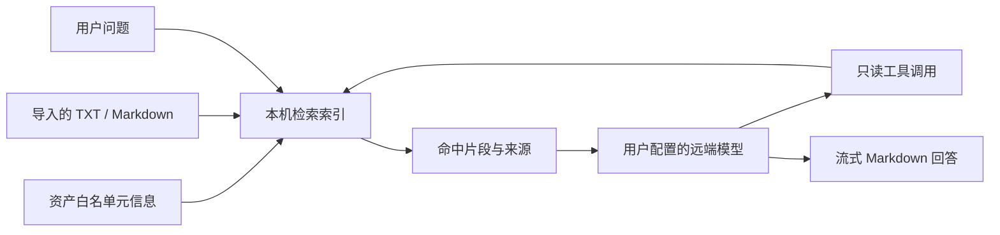

# 司南 Nanpad

个人数字资产工作台，将主机、域名、邮箱、AI 订阅、密钥和证书集中到一个桌面应用中。资产保存在本机；通过 SSH、DNS、TLS 和服务商 API 读取实际状态，通过你配置的模型进行有来源的问答。

[下载安装包](https://github.com/Songwo/nanpad/releases/latest) · [使用教程](docs/USER-GUIDE.md) · [产品介绍](docs/PRODUCT.md) · [AI 服务授权](docs/AI-ACCOUNTS.md) · [模型与本地 RAG](docs/AGENT-RAG.md) · [安全与备份](docs/SECURITY.md) · [更新日志](CHANGELOG.md)


## 安装与首次使用

1. 在 GitHub Releases 下载 `Nanpad-0.2.0-setup.exe`，适用于 Windows x64。
2. 运行安装程序，选择安装位置。当前安装包未做代码签名，请核对发布者、下载地址和 Release 中的 SHA256 校验文件。
3. 首次启动填写自己的名字，创建至少 10 个字符的主密码，并再次确认。主密码不能找回。
4. 已有密钥库的用户填写姓名及原主密码即可继续，升级不会自动删除资产或演示记录。
5. 添加资产，然后在「设置 → 模型与知识库」配置模型或连接 AI 服务账号。

安装软件无需 Node.js。macOS 和 Linux 有构建配置，但此版本仅提供在 Windows 构建的安装包。

## 功能概览

| 功能 | 实际能力 |
| --- | --- |
| 主机 | SSH 终端、CPU/内存/磁盘采样、最近 30 天指标历史、SFTP 文件浏览与下载 |
| 域名与证书 | WHOIS、DNS 查询、TLS 证书检查、到期提示 |
| 邮箱 | IMAP 登录验证、容量和未读信息；另有 Google/Microsoft 邮箱身份授权 |
| 凭据库 | scrypt 派生密钥、AES-256-GCM 加密，支持锁定和修改主密码 |
| 资产组织 | 标签、搜索、卡片、排序分页表格、关系图与双向关联 |
| 提醒 | 托盘、系统通知、ICS 日历导出 |
| 模型问答 | OpenAI 兼容接口、流式回答、可取消生成、真实工具调用、来源引用 |
| 本地知识库 | TXT/Markdown 导入、中文检索、本地 BM25、可选本机 Embedding 混合检索 |
| AI 账号 | OpenAI、Claude、Grok、Gemini 网页授权，令牌加密保存、按需刷新与额度查询 |
| 界面 | 中英文、跟随系统主题、浅色/深色、减少动态效果、Markdown 表格和代码块 |

## AI 服务如何连接

**模型调用**：选择 OpenAI、Grok、Gemini、DeepSeek、通义千问、火山方舟等 API 预设，或者填写自定义 Base URL。输入该服务的 API Key 和准确模型名，保存后读取模型列表并测试连接。支持已有的 `https://znck.zle.ee/v1` 兼容服务。

**订阅账号**：在同一设置页面的「AI 服务账号」中选择服务商并点击网页登录授权。OpenAI、Grok、Gemini 自动通过本机回调返回；Claude 需要粘贴网页给出的完整 `code#state`。密码由你在服务商网页输入，Nanpad 不读取浏览器 Cookie。

这两种连接使用不同凭据。订阅 OAuth 目前用于账号信息和额度查询，不会自动替换问答的 API Key，也不承诺把 ChatGPT、Claude 或 Google One 订阅转换成通用 API 余额。详细范围见 [AI 服务账号文档](docs/AI-ACCOUNTS.md)。

服务商不返回的字段显示「未提供」。令牌有效期、额度重置时间和订阅到期时间分别展示。真实账号登录受账户资格、地区、网络与上游接口变化影响；协议测试不等于每个真实账号都已验收。

## 本地 RAG 与 Agent



默认执行本机全文检索。开启向量模式后，可连接本机 OpenAI 兼容 Embedding 服务；向量地址仅允许回环地址。Agent 工具包括知识检索、资产读取和资产统计，不执行 SSH 命令、不修改资产、不读取凭据库。服务器错误、缺少配置或流中断均显示实际错误，不使用规则答案伪装模型响应。

## 数据与隐私

- 姓名是本机资料，不是云端账号。资产元信息、聊天记录、导入文档和指标文件保存在本机，默认没有整体加密。
- SSH 凭据和 AI OAuth 令牌存放在主密码保护的 `vault.enc` 中。模型 API Key 由操作系统安全存储加密，保护方式与主密码库不同。
- 问题、近期对话及检索命中片段会发送给所选模型服务。导入的文档可能被引用，请勿导入密码或私钥。
- 锁定密钥库会保护凭据读取，但不会隐藏全部资产、聊天记录，也不会自动停用操作系统加密保存的模型 API Key。
- Markdown 不执行原始 HTML；只允许 HTTP/HTTPS 外链，不自动加载文档里的远程图片。
- JSON 资产导出不包含凭据库。完整备份、迁移和主密码遗失处理见 [安全与备份](docs/SECURITY.md)。

## 开发与验证

需要 Node.js 22、npm，以及可下载依赖的网络环境。

```bash
npm ci
npm run desktop
```

桌面开发命令启动 Vite 与 Electron。只预览网页界面时运行 `npm run dev`；网页不具备桌面的 SSH、本地文件与密钥库能力。

```bash
npm run typecheck
npm run lint
npm run i18n:check
npm test
npm run desktop:build
node scripts/agent-integration.mjs
npm run build
```

集成测试使用隔离数据目录和本机协议测试服务，不读取日常账号。发布构建：

```bash
npm run desktop:dist -- --win --x64 --publish never
```

安装包输出到 `release/`。打包排除后端测试文件；日常资产、私钥和登录令牌不属于构建输入。发布流程见 [发布说明](docs/RELEASING.md)。

## 项目结构

| 目录 | 内容 |
| --- | --- |
| `electron/main.mjs`、`preload.cjs` | 桌面窗口、白名单 IPC 与原生能力 |
| `electron/services/` | SSH、凭据库、RAG、Agent、OAuth 服务与单元测试 |
| `src/components/` | 资产工作台、首次设置、问答、设置等 React 界面 |
| `src/lib/` | 状态、桥接类型、国际化与界面业务逻辑 |
| `scripts/` | 构建、验证、截图和开发辅助工具 |
| `docs/` | 使用教程、产品介绍、AI 接入、安全与发布指南 |

## 已知边界

SSH 指标采集面向提供 `/proc` 的 Linux 主机。WHOIS 可能因注册局限制无法返回到期日。OAuth 使用供应商公开客户端及兼容接口，可能因供应商调整失效；账号连接失败会显示错误，不会读取其他应用已有登录数据补救。Gemini 额度查询要求账号已经开通 Code Assist 并能返回项目。服务商订阅结束日期目前没有统一可查询来源，软件不会据令牌有效期推算订阅到期。

问题反馈请提交 [GitHub Issue](https://github.com/Songwo/nanpad/issues)，包含版本、操作步骤与去除敏感信息后的错误。不要提交 API Key、Token、主密码或完整个人数据文件。
