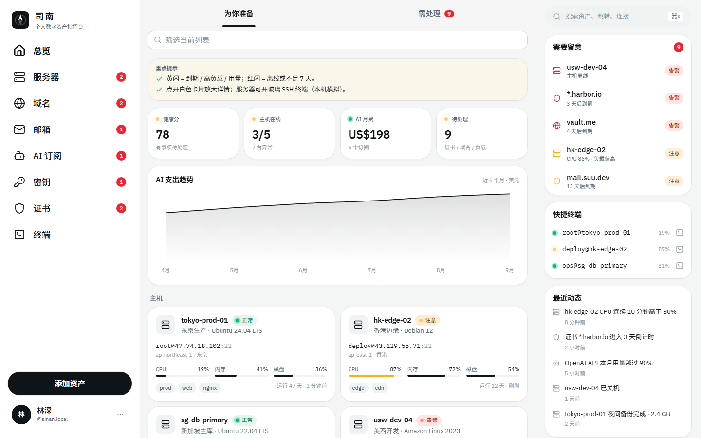
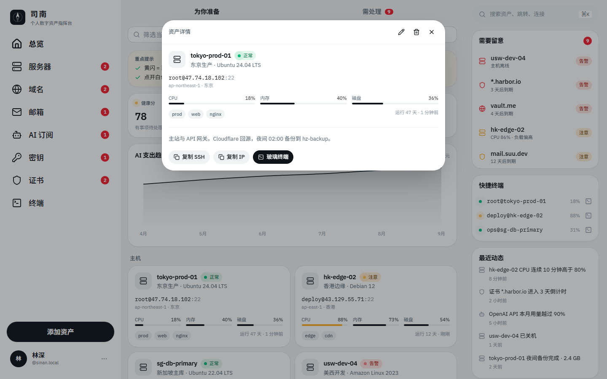
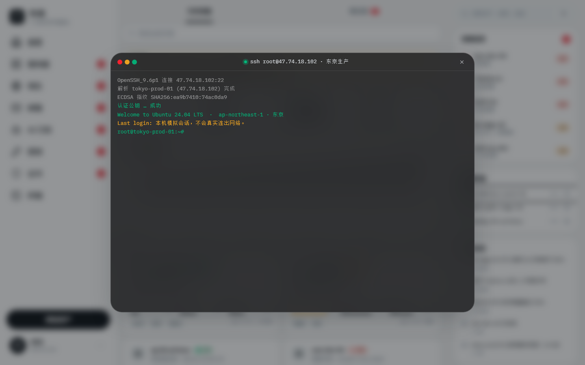
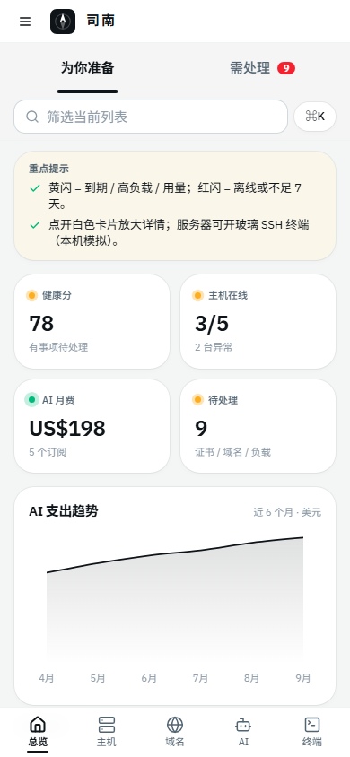

# 司南 · Nanpad

> 个人数字资产指挥台 —— 服务器、域名、邮箱、AI 订阅、密钥与证书，一屏尽览。

司南（Sīnán）是汉代的磁石罗盘：一块方形地盘，一根永远知道方向的勺针。这个应用做的是同一件事——把散落在各处的数字资产收进一块盘面，让你一眼看出**哪边有问题**。



---

## 目录

- [它是什么](#它是什么)
- [功能](#功能)
- [界面与动效](#界面与动效)
- [截图](#截图)
- [快速开始](#快速开始)
- [键盘快捷键](#键盘快捷键)
- [项目结构](#项目结构)
- [设计系统](#设计系统)
- [数据与隐私](#数据与隐私)
- [技术栈](#技术栈)
- [开发脚本](#开发脚本)
- [部署](#部署)
- [路线图](#路线图)

---

## 它是什么

一个**纯前端**的资产看板。没有后端、没有账号、没有数据库——所有数据存在你自己的浏览器里（`localStorage`），可随时导出 / 导入 JSON。

它解决的是这样一个问题：你手上有几台 VPS、十几个域名、一堆邮箱转发规则、五六个 AI 订阅、若干 API Key 和 SSL 证书。它们分散在阿里云、Cloudflare、OpenAI、1Password……**没有任何一个地方能同时告诉你"下周有什么要到期、哪台机器现在不对劲"**。司南就是那个地方。

内置的 SSH 终端是**浏览器内模拟**的，不会真实连出网络——用来演练命令、给人演示、或者只是好看。

---

## 功能

| 模块 | 说明 |
| --- | --- |
| **总览** | 健康分、在线主机数、AI 月费、待处理数；AI 支出趋势图；最近动态流 |
| **服务器** | 主机名 / IP / 端口 / 系统 / 区域 / 标签，CPU·内存·磁盘实时跳动 |
| **域名** | 注册商、DNS、到期倒计时、自动续费状态、Nameservers |
| **邮箱** | 邮箱 / 别名 / 转发三种类型，容量占用 |
| **AI 订阅** | 厂商、套餐、月费、本月用量百分比、续费日 |
| **密钥** | API / SSH / 密码 / Token，一键复制完整值 |
| **证书** | CN、签发者、SAN 列表、到期倒计时 |
| **终端** | 玻璃拟态 SSH 会话，支持 30+ 常用命令与上下键历史 |

**状态语义**（全局一致，三色制）：

- 🟢 **正常** —— 无需关注
- 🟡 **注意**（黄闪）—— 到期 ≤ 21 天 / 负载偏高 / 用量 ≥ 90%
- 🔴 **告警**（红闪）—— 主机离线，或到期 ≤ 7 天

每个资产都可以**新增、编辑、删除**；右栏「需要留意」把六类资产的异常项按严重度汇总在一起。

---

## 界面与动效

桌面端是 **三栏布局**：左侧导航、中间内容列、右侧常驻信息栏（全局搜索 / 需要留意 / 快捷终端 / 最近动态）。中间列用 CSS 容器查询决定卡片列数，因此列宽变化时布局跟着变，而不是跟着窗口宽度瞎变。

动效遵循一条原则：**交互状态用 transition，一次性入场用 keyframes**。前者可以在动画中途反向、不会卡住；后者只在元素出现时跑一次。

- **卡片放大 / 收起** —— FLIP 共享元素动画。详情面板从被点击的那张卡片长出来，关掉时缩回**它当前的真实位置**（滚动过也不会缩错地方）
- **标签下划线** —— 一根横条在两个标签之间滑动，宽度跟着文字走
- **视图切换** —— 内容整体 opacity + translateY + blur 入场，列表项 40ms 阶梯错峰
- **数字滚动** —— 健康分、月费等大数字用三次缓出滚到目标值
- **弹层** —— 遮罩淡入、面板 blur + scale 入场；退场时长约为入场的一半（退场不该抢注意力）
- **移动端抽屉 / 底部弹层** —— 从它所属的那条边滑入
- **终端** —— 逐行开机日志、闪烁光标、玻璃背景模糊
- **状态点** —— 正常呼吸、注意 1.35s 闪、告警 0.9s 闪

全部动效都受 `prefers-reduced-motion: reduce` 保护，系统开了"减少动态效果"就整体关闭。

---

## 截图

<table>
<tr>
<td width="50%"><br><em>点开卡片 → FLIP 放大详情</em></td>
<td width="50%"><br><em>玻璃拟态 SSH 终端（本机模拟）</em></td>
</tr>
</table>



---

## 快速开始

需要 **Node 22+**。

```bash
npm install
npm run dev
```

打开 http://localhost:8080 。

首次进入会载入一套演示数据（5 台主机、若干域名 / 邮箱 / 订阅 / 密钥 / 证书）。左下角头像旁的 `···` 里可以**导出 JSON**、**导入 JSON**、**重置演示数据**。

> Windows 提示：`npm run dev` 通过 `scripts/with-app-env.mjs` 启动 Vite，该脚本用 `spawn` 直接调用 `vite`，在 Windows 上会报 `ENOENT`。可以改用：
>
> ```bash
> node scripts/with-app-env.mjs node node_modules/vite/bin/vite.js dev --host 0.0.0.0 --port 8080
> ```

---

## 键盘快捷键

| 按键 | 作用 |
| --- | --- |
| `⌘K` / `Ctrl+K` | 全局搜索：跳转页面、定位资产、直接连 SSH |
| `⌘N` / `Ctrl+N` | 在当前分类下新建资产 |
| `/` | 打开命令面板 |
| `Esc` | 关闭当前弹层 / 终端 / 详情 |
| `↑` `↓` | 终端内翻命令历史 |

终端里输入 `help` 查看全部可用命令（`ls` `top` `df -h` `docker ps` `systemctl status` `neofetch` …）。破坏性命令（`rm` / `reboot` / `shutdown`）会被拒绝。

---

## 项目结构

```
src/
├─ components/
│  ├─ app-shell.tsx       三栏骨架、移动端抽屉与底栏、全局快捷键
│  ├─ sidebar.tsx         左栏导航 + 主 CTA + 个人菜单
│  ├─ right-rail.tsx      右栏：全局搜索 / 需要留意 / 快捷终端 / 最近动态
│  ├─ views.tsx           标签栏（滑动下划线）、总览、六个资产列表
│  ├─ asset-card.tsx      六种资产卡片（compact / 展开两态共用）
│  ├─ expand-layer.tsx    FLIP 放大详情层
│  ├─ composer.tsx        新增 / 编辑表单弹层
│  ├─ command-palette.tsx ⌘K 命令面板
│  ├─ ssh-terminal.tsx    玻璃 SSH 终端与命令解释器
│  ├─ logo.tsx            司南标记（罗盘针）
│  └─ ui/                 Button / Input / TimeAgo / CountUp
├─ lib/
│  ├─ store.ts            zustand + persist，全局状态与资产 CRUD
│  ├─ motion.ts           usePresence / useCountUp / FLIP 计算 / 减动效判定
│  ├─ status.ts           状态语义、健康分、异常统计
│  ├─ live.ts             CPU / 内存的实时抖动
│  ├─ seed.ts             演示数据
│  ├─ types.ts            资产类型定义
│  └─ utils.ts            cn()（已按本项目 token 配置 tailwind-merge）、格式化
├─ routes/                TanStack Start 路由
└─ styles.css             设计 token + 组件类 + 动效 keyframes
```

---

## 设计系统

所有 token 定义在 `src/styles.css` 的 `@theme` 里，作为 Tailwind v4 的 CSS 变量单一来源。JSX 里没有裸十六进制色值，也没有 `p-[16px]` 这类随手值。

**颜色**（中性色 + 三个状态色，共 5 个色相以内）

| Token | 值 | 用途 |
| --- | --- | --- |
| `--color-canvas` | `#f4f5f5` | 页面底色 |
| `--color-card` / `--color-sidebar` | `#ffffff` | 卡片、侧栏 |
| `--color-ink` | `#0f1419` | 正文、主按钮 |
| `--color-muted` / `--color-subtle` | `#536471` / `#8b98a5` | 次级、三级文字 |
| `--color-line` / `--color-line-strong` | `#eff3f4` / `#cfd9de` | 分隔线、输入框描边 |
| `--color-ok` / `--color-warn` / `--color-crit` | `#00ba7c` / `#ffad1f` / `#f4212e` | 正常 / 注意 / 告警 |

**字体**：IBM Plex Sans（正文，中文回落到思源黑体 / Noto Sans SC）+ IBM Plex Mono（主机名、IP、终端）。

**动效尺度**：`--dur-fast: 150ms`（悬停、按压）、`--dur-base: 240ms`（弹层）、`--dur-slow: 340ms`（下划线、FLIP），缓动统一用 `--ease-out-soft`。

> ⚠️ 一个值得记下的坑：`tailwind-merge` 默认只认识原生 Tailwind 的类名。自定义颜色 `text-card` 会被它误判成**字号**类，于是后面的 `text-body` 把颜色悄悄吃掉——主 CTA 因此变成黑底黑字。`src/lib/utils.ts` 里用 `extendTailwindMerge` 把本项目的 token 全部登记了一遍，这类问题才不会再出现。

---

## 数据与隐私

- 所有资产只存在**你当前这个浏览器**的 `localStorage`（key：`nexus-assets-v1`）
- 没有任何网络请求会把资产数据发出去
- SSH 终端不建立真实连接，命令输出由 `ssh-terminal.tsx` 本地生成
- 密钥字段以明文存在浏览器本地存储中——**这是一个演示 / 自用看板，不是密码管理器**，请不要往里面放真正重要的凭证
- 换设备用「导出 JSON → 导入 JSON」

---

## 技术栈

- **React 19** + **TypeScript**（`strict`）
- **TanStack Start / Router** —— 文件路由与 SSR
- **Tailwind CSS v4** —— CSS-first token，容器查询
- **zustand**（+ `persist`）—— 状态与本地持久化
- **recharts** —— 支出趋势图
- **cmdk** —— ⌘K 命令面板
- **lucide-react** —— 图标
- **sonner** —— toast
- **Vite 8** —— 构建

---

## 开发脚本

```bash
npm run dev        # 开发服务器 :8080
npm run build      # 生产构建
npm run preview    # 预览构建产物 :8081
npm run typecheck  # tsc --noEmit
npm run lint       # eslint
npm run format     # prettier --write .
```

---

## 部署

项目按 Vercel 目标配置（`vite.config.ts` 里的 nitro preset）。因为不依赖数据库和服务端接口，导出的静态产物放到任何静态托管上也能跑。

---

## 路线图

- [ ] 深色模式（token 已经就位，只差一层 `@media (prefers-color-scheme)` 覆盖）
- [ ] 到期提醒：把「需要留意」导出成 ICS 日历
- [ ] 资产之间的关联（域名 → 证书 → 主机）
- [ ] 键盘全导航：`j/k` 在卡片间移动
- [ ] 密钥字段加一层本地口令加密

---

## 许可

MIT
