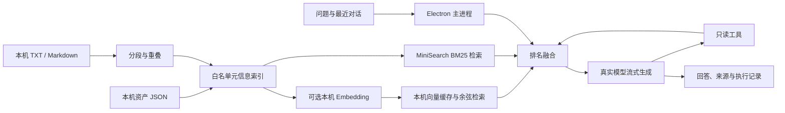

# 桌面模型与本地 RAG

问答页通过 Electron 主进程调用真实 OpenAI 兼容模型。当前默认 Base URL 是 `https://znck.zle.ee/v1`。没有模型配置、鉴权失败或网络失败都会明确报错，不会调用旧的关键词问答来补一个假答案。

## 配置

1. 在问答页右上角或「设置 → 模型与知识库」打开配置。
2. 填写 Base URL、API Key。点击「读取模型」后选择或输入该服务支持的模型名称。
3. 点击「测试连接」，它会真正请求一次模型生成，消耗少量模型额度。成功提示包含服务返回的模型名与耗时。
4. 保存后回到问答，提问并展开「检索来源」检查依据。

模型必须支持 OpenAI Chat Completions 的流式输出和 function tool calls。支持自建 OpenAI 兼容网关，以及开启兼容接口的本机 Ollama。模型名由服务提供，不预设一个可能不存在的名称。仅本机地址允许 HTTP；远程服务要求 HTTPS，禁止携带查询凭据的地址及 HTTP 重定向。

API Key 通过 Electron `safeStorage` 加密，在 Windows 上由当前操作系统用户保护。应用读取配置时只返回 `hasApiKey`，不把保存的 Key 回传到界面。更换 Base URL 时清除旧 Key 的关联，避免向另一服务发送旧凭据。系统加密不可用时拒绝保存 Key。

## 执行链路

- 每次提问基于当时资产与知识库构建索引，更新或删除资产会影响下一轮问答。
- 文档每段最多 1000 字符，步长 800，保留 200 字符重叠。中文使用单字及双字词片段检索，英文使用词项；标题权重更高。
- 默认使用本机 MiniSearch 的 BM25 全文检索，不要求安装向量模型。
- 开启「本地向量混合检索」后，通过本机 `/v1/embeddings` 生成向量，再在本机计算余弦相似度，并使用倒数排名融合与 BM25 合并。Embedding 地址限制为回环地址，不把文档交给远程 Embedding 服务。
- 向量缓存以内容哈希和 Embedding 地址、模型名区分。文档未变化时复用向量，仅生成问题向量；删除文档立即清理衍生缓存。
- 模型得到问题、最多 12 条近期文本消息与命中的片段。资产密码、私钥、密钥值和自由备注不参与自动索引；用户导入的文档内容则会参与检索。
- 文档与工具输出在系统提示中明确标记为不可信数据。模型生成中的 `[S1]` 等来源标记必须存在于当次检索结果，未知来源会报告失败。

## Agent 工具

| 工具 | 行为 |
| --- | --- |
| `search_knowledge` | 根据模型给出的查询词检索本机资产和知识文档 |
| `get_asset` | 按来源 ID 读取资产白名单字段与已保存关联 |
| `asset_summary` | 返回全量分类计数、已记录 AI 月费、异常资产与可引用统计快照 |

工具都是只读操作，不执行 SSH 命令，不修改远程或本机资产，不读取凭据库。需要有写操作的 Agent 时应另行设计预览与确认机制。

默认最多 4 轮工具调用，然后要求模型给出最终回答；可配置为 1 到 6 轮。每轮最多 8 个工具调用，最多累计 40 个引用来源，整体上下文最多 140000 字符。单请求超时 45 秒，一次问答总超时 120 秒，输出 Token 上限可配置。没有自动重试，避免限流时叠加请求。停止按钮会取消底层 HTTP/SSE 请求。

生成中的文本仅留在内存；成功、失败或停止后将结果写入原对话，避免切换对话导致串线。历史包含来源片段、模型名、执行轮数及调用的工具，不保存模型内部推理过程。

## 本地文件

以下文件位于 Nanpad 用户数据目录：

| 文件 | 内容 |
| --- | --- |
| `assets.json` | 资产记录及关联 |
| `agent-config.json` | 模型设置和系统加密后的 API Key |
| `knowledge.json` | 导入文档原文、名称及时间 |
| `rag-index.json` | 最近重建的全文索引 |
| `rag-vectors.json` | 可选本机 Embedding 向量缓存 |
| `conversations.json` | 问答记录、来源和运行结果 |

知识库及聊天记录是本机明文数据。导入仅支持 UTF-8 TXT、Markdown，每份最多 500 KB / 100000 字符，共最多 30 份文档，资产和文档合计最多 6000 个片段。不要导入密码或密钥。暂不支持 PDF、网页抓取和外部数据库。

## 演示数据

生产版本不提供添加演示数据入口。开发集成测试可以在隔离目录追加 22 项资产、13 条关联和一份运维手册，包含 API 高负载、数据库备份、证书到期、域名续费和 AI 成本治理场景。演示主机使用 `192.0.2.0/24` 保留地址，域名使用 `.example`，并带有「演示」标签。升级不会删除用户已有演示记录。

演示数据不执行真实主机采集、域名或证书探测，不触发系统通知，也不包含有效密钥。示例月费和指标用于体验界面，不能视为真实监控或账单。

## 验证

- `npm test`：包含 `electron/services/agent-service.test.mjs` 的协议、RAG、向量缓存、取消、错误、加密边界与并发写入测试。
- `node scripts/agent-integration.mjs`：使用隔离用户数据和明确的本机模拟模型，验证真实 Electron 界面和 SDK 协议往返。这是集成测试，不代表远程模型已认证成功。
- 对实际供应商的验收需要有效 API Key 和真实模型名，再执行「测试连接」及一次带来源的 RAG 问答。无凭据时仅能验证接口可达和鉴权要求，不能宣称已完成线上推理验证。
