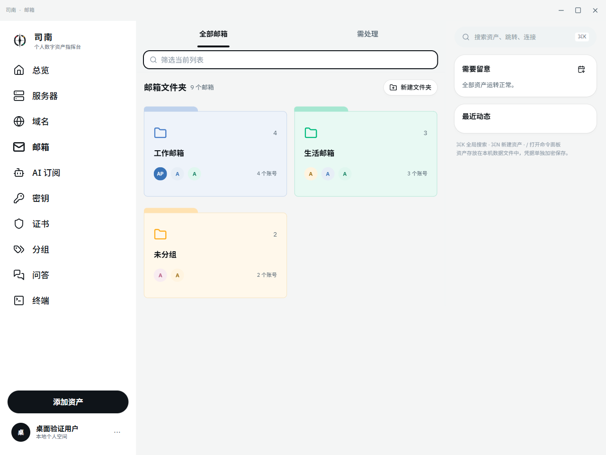
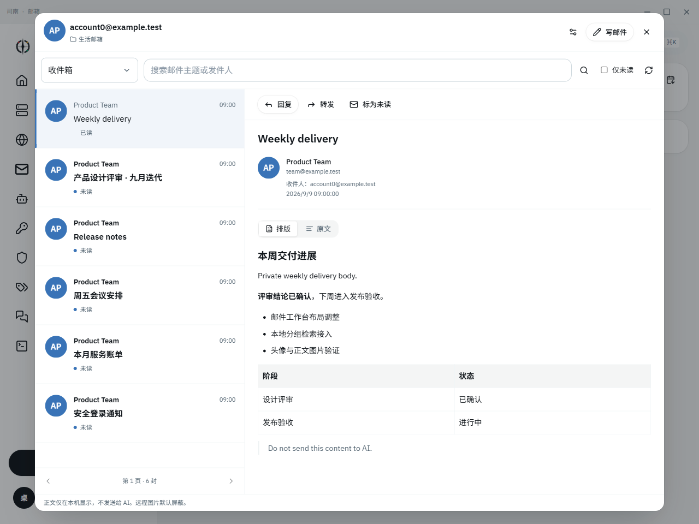
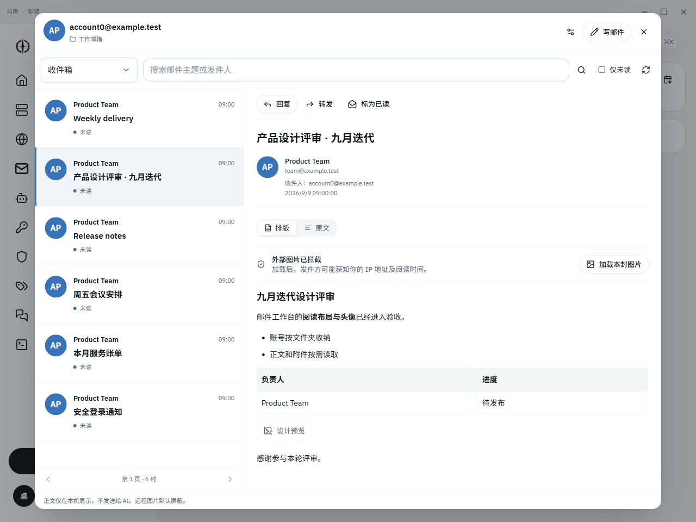

# 邮件工作台

本教程对应司南 0.6.0，收发邮件需要 Windows 桌面端及已解锁的主密码库。

## 用文件夹收纳邮箱

邮箱页默认展示「工作邮箱」「生活邮箱」「未分组」文件夹，首页只显示每组账号数量和少量头像，不展开所有邮箱。旧账号保留原数据，未指定分组的账号放在「未分组」。

点击「新建文件夹」可设置名称和颜色。进入某个文件夹，勾选邮箱后用「移动到文件夹」批量调整归属。「添加邮箱」会沿用当前文件夹。文件夹内的编辑按钮可重命名、更换颜色或删除文件夹；删除后账号回到「未分组」，不会删除邮箱、凭据或服务器上的邮件。标签和跨资产关联仍独立保留。

顶部搜索支持邮箱地址、域名、标签、说明和分组名称。搜索「工作邮箱」可以找到该组及组内账号，名称匹配的空文件夹也会显示。标签及状态筛选仍会影响显示的账号数量。

点击账号左侧头像，打开「邮箱头像与分组」，上传图片、选择「所属文件夹」后保存。阅读器左上角的账号头像或分组名称也提供相同入口，无需进入完整资产编辑表单。

已配置真实模型时，可以在问答中询问「有哪些邮箱分组」「工作邮箱里有哪些账号」。Agent 查询本机保存的完整分组目录和账号归属，包含空组与未分组，区分别名和演示记录。改名或移动后在下一次问答生效。这些是司南的账号收纳组，不是服务器的收件箱、已发送等邮件目录，查询时无需勾选「本次允许查询邮箱」。

## 连接服务商

1. 在邮箱详情保存用户名与密码／客户端授权码。QQ、163、126 等通常需要先在官网开启 IMAP / SMTP，再创建客户端授权码。
2. 点击邮箱地址，解锁密钥库，打开邮件工作台。
3. 在「连接设置」填写 IMAP 主机和 TLS 端口（通常 993），以及 SMTP 主机、端口和加密方式。
4. 可点击「填入服务商预设」，随后自行核对。SMTP 465 通常使用 TLS，587 通常使用 STARTTLS；本版强制验证服务器证书，STARTTLS 不允许降级成明文。
5. 保存设置后返回收件箱。连接失败会显示错误，不生成模拟邮件。

收信和发信共用该邮箱已加密保存的账号凭据。Google/Microsoft 的身份登录入口不等于 IMAP / SMTP OAuth 授权；仅允许 OAuth、禁用密码协议登录的账号暂不支持这条收发链路。Gmail 可在账号政策允许时使用应用专用密码；Outlook/Microsoft 以服务商和租户的认证政策为准。

## 阅读邮件

工作台左侧列出邮件，每页 30 封，按新到旧排列。可切换服务器实际返回的收件箱、已发送、草稿等文件夹，按主题或发件人搜索，并筛选未读邮件。列表显示发件人头像、日期和未读状态；列表及正文等待期间显示骨架占位，正文出现时有短暂过渡，系统减少动态效果偏好会关闭这些动画。

点开邮件后在右侧阅读；窄窗口会切换到正文页，使用「返回列表」返回。阅读操作不会自动标记已读，使用「标为已读／未读」明确修改服务器状态。服务器重置 UID 标识后会要求刷新，避免把旧列表位置误认成另一封邮件。

正文默认使用「排版」视图：有 HTML 的邮件在本机净化后保留标题、列表、表格和有限文字样式；纯文本邮件按 Markdown / GFM 显示标题、粗体、引用、代码块及表格。切换「原文」可查看解析后的纯文本，其中保留 Markdown 标记；它不是完整的 `.eml` 源文件或 HTML 源码。邮件脚本、表单和嵌入网页不会执行或展示，复杂营销邮件的布局可能与服务商网页不同。

外部正文图片默认显示拦截提示。确认风险后点击「加载本封图片」，只对当前这次打开的邮件生效；切换或重新读取后需要再次授权，也可点击「隐藏外部图片」停止展示。图片服务器仍可能获知你的 IP 地址和阅读时间，隐藏图片不能撤回已经发出的请求。文档和模型回答中的图片策略不随这项设置改变。

随邮件携带、通过 CID 引用的 PNG、JPEG、WebP 图片可以在本机展示，单张不超过 1 MiB，每封最多内联 20 张、合计 3 MiB。格式、尺寸或数量超限时保留附件下载入口。邮件大于 12 MiB 或 HTML 解析超出限制时，请到服务商网页查看；HTML 排版处理上限为 1 MiB。附件列表显示名称和大小，点击下载后由系统保存对话框选择位置；单附件最多 8 MiB。

### 发件人头像

打开邮件后点击正文上方的发件人头像，可上传、更换或移除本地图片。没有自定义图片时，优先使用地址相同的已保存邮箱头像，再回退为首字母。自定义头像按当前收信账号分别保存，每个邮箱最多 32 个；不会自动从 Gravatar 或服务商抓取头像，也不与其他收信账号同步。

支持 PNG、JPEG、WebP，单文件不超过 8 MiB，最长边不超过 8192 像素、总像素不超过 2400 万。图片在本机缩至最长边 256 像素并转为 PNG，单张保存内容不超过 1 MiB；同一邮箱的发件人头像编码合计不超过 8 MiB。头像及对应发件人地址保存在明文资产文件中，资产导出和完整备份会带出这些记录。

## 快速写信

点击「写邮件」，填写收件人、主题和正文。多个地址使用逗号分隔，每类收件人最多 20 个。可添加抄送、密送和最多 5 个附件，附件合计不超过 8 MiB，正文最多 256000 个字符。

点击「发送」后先核对收件人、抄送／密送和主题，再点「确认发送」。SMTP 服务器接受请求不等于对方最终投递成功。服务器部分拒绝时保留草稿；连接中断或结果不明时不自动重发，请先核对服务商记录，避免重复邮件。

「回复」预填 Reply-To／发件人并引用原正文；「转发」引用文本正文，附件需要手动重新选择。是否自动保存到服务器「已发送」由服务商决定，本版不另外向 IMAP 追加发送副本。

## 草稿与隐私

「保存草稿」将当前邮件和附件保存在主密码库内，每个邮箱保留一份本地草稿；「恢复草稿」读取这份草稿，与服务器的 Drafts 文件夹不同。关闭有未保存编辑的写信窗口时会提示确认。成功向全部收件人提交后清除本地草稿；清除失败会单独提示，不会再次发送。

锁库会取消正在进行的邮件任务，卸载阅读区并清除内存中的正文和未保存编辑。已发出的 SMTP 数据无法撤回，因此发信中锁库或断网仍可能出现结果不确定的情况。

邮件正文和草稿不写入资产快照、聊天记录或 RAG 索引。Agent 可以查询本机邮箱分组及账号元信息；连接服务器查询实时数量仍需要本次问答许可，不读取邮件内容。自动提醒也只推送数量。本版没有 Agent 自动发信、邮件删除、联系人同步或后台完整邮件缓存。
